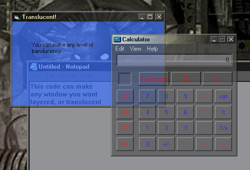

<div align="center">

## Windows 2000 Layered Windows, aka Translucent Windows or Alpha Blended Windows \(fully movable etc\)


</div>

### Description

This code utilizes Windows 2000's layered window effect, (commonly referred to as alpha blended windows or translucent windows) described at http://msdn.microsoft.com/library/techart/layerwin.htm. You must have Windows 2000 for this code to work.
 
### More Info
 


<span>             |<span>
---                |---
**Submitted On**   |
**By**             |[Rom](https://github.com/Planet-Source-Code/PSCIndex/blob/master/ByAuthor/rom.md)
**Level**          |Intermediate
**User Rating**    |4.7 (33 globes from 7 users)
**Compatibility**  |VB 5\.0, VB 6\.0
**Category**       |[Windows API Call/ Explanation](https://github.com/Planet-Source-Code/PSCIndex/blob/master/ByCategory/windows-api-call-explanation__1-39.md)
**World**          |[Visual Basic](https://github.com/Planet-Source-Code/PSCIndex/blob/master/ByWorld/visual-basic.md)
**Archive File**   |[](https://github.com/Planet-Source-Code/rom-windows-2000-layered-windows-aka-translucent-windows-or-alpha-blended-windows-fully-mo__1-8901/archive/master.zip)


### Source Code

```
'Win2k layered windows module
'
'This information was found at
'http://msdn.microsoft.com/library/techart/layerwin.htm
'and other parts of msdn.
'
'If you want to check if a window is already layered,
'CheckLayered(hwnd) will return true or false
'
'To make a window layered, just use SetLayered,
'where hwnd is the handle of window, and bAlpha
'is the amount of transparency (e.g. 0 = invisible,
'255 = opaque), and if True is passed to SetAs
'it will make the window layered, if False is
'passed then it will get rid of the layered property.
Declare Function GetWindowLong Lib "user32" Alias "GetWindowLongA" (ByVal hWnd As Long, ByVal nIndex As Long) As Long
Declare Function SetWindowLong Lib "user32" Alias "SetWindowLongA" (ByVal hWnd As Long, ByVal nIndex As Long, ByVal dwNewLong As Long) As Long
Declare Function SetLayeredWindowAttributes Lib "user32" (ByVal hWnd As Long, ByVal crKey As Long, ByVal bAlpha As Byte, ByVal dwFlags As Long) As Long
Declare Function UpdateLayeredWindow Lib "user32" (ByVal hWnd As Long, ByVal hdcDst As Long, pptDst As Any, psize As Any, ByVal hdcSrc As Long, pptSrc As Any, crKey As Long, ByVal pblend As Long, ByVal dwFlags As Long) As Long
Declare Function FindWindow Lib "user32.dll" Alias "FindWindowA" (ByVal lpClassName As Any, ByVal lpWindowName As Any) As Long
Public Type POINTAPI
  x As Long
  y As Long
End Type
Public Type SIZE
  cx As Long
  cy As Long
End Type
Public Type BLENDFUNCTION
  BlendOp As Byte
  BlendFlags As Byte
  SourceConstantAlpha As Byte
  AlphaFormat As Byte
End Type
Public Const WS_EX_LAYERED = &H80000
Public Const GWL_STYLE = (-16)
Public Const GWL_EXSTYLE = (-20)
Public Const AC_SRC_OVER = &H0
Public Const AC_SRC_ALPHA = &H1
Public Const AC_SRC_NO_PREMULT_ALPHA = &H1
Public Const AC_SRC_NO_ALPHA = &H2
Public Const AC_DST_NO_PREMULT_ALPHA = &H10
Public Const AC_DST_NO_ALPHA = &H20
Public Const LWA_COLORKEY = &H1
Public Const LWA_ALPHA = &H2
Public Const ULW_COLORKEY = &H1
Public Const ULW_ALPHA = &H2
Public Const ULW_OPAQUE = &H4
Public lret As Long
Function CheckLayered(ByVal hWnd As Long) As Boolean
lret = GetWindowLong(hWnd, GWL_EXSTYLE)
If (lret And WS_EX_LAYERED) = WS_EX_LAYERED Then
  CheckLayered = True
Else
  CheckLayered = False
End If
End Function
Sub SetLayered(ByVal hWnd As Long, SetAs As Boolean, bAlpha As Byte)
lret = GetWindowLong(hWnd, GWL_EXSTYLE)
If SetAs = True Then
  lret = lret Or WS_EX_LAYERED
Else
  lret = lret And Not WS_EX_LAYERED
End If
SetWindowLong hWnd, GWL_EXSTYLE, lret
SetLayeredWindowAttributes hWnd, 0, bAlpha, LWA_ALPHA
End Sub
```

